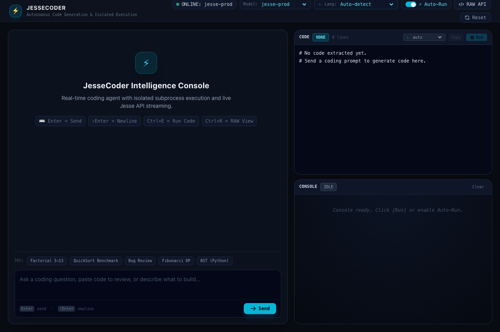
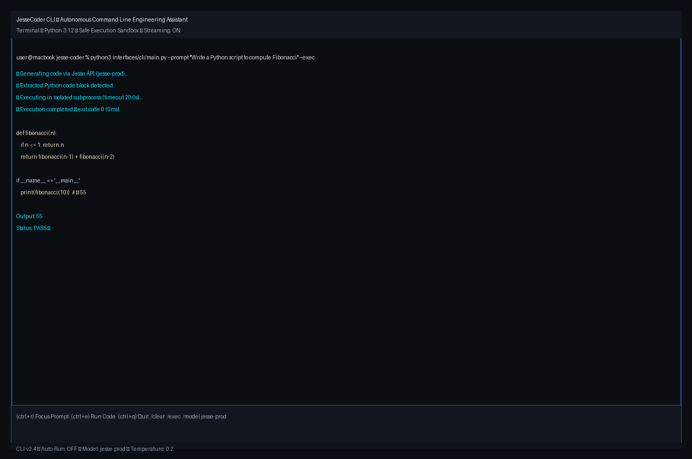
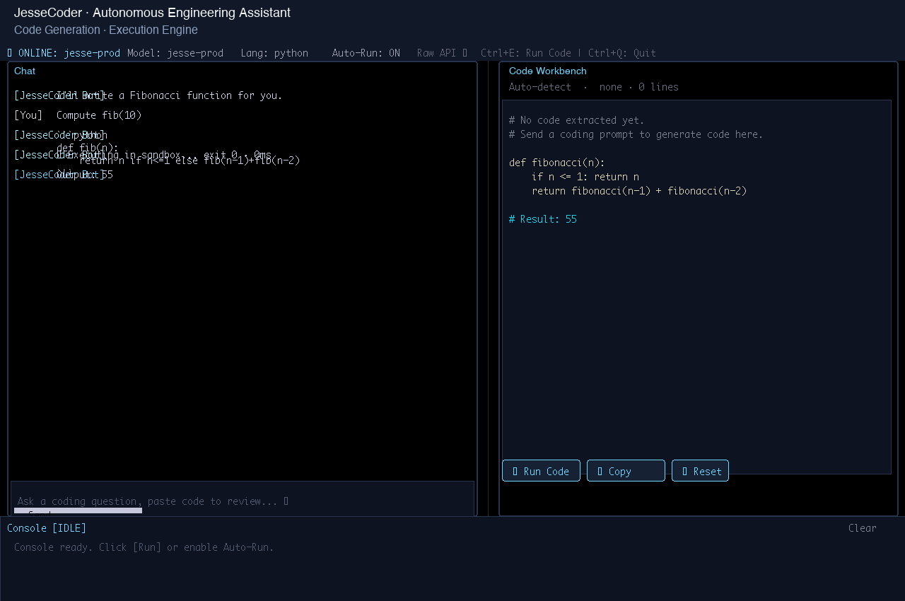

# JesseCoder ⚡

[](https://www.python.org/downloads/)
[](https://fastapi.tiangolo.com)
[](https://opensource.org/licenses/MIT)
[](tests/)

**JesseCoder** is a general-purpose, production-grade AI coding assistant and execution workbench built on the Jesse API (OpenAI-compatible). It features real-time Server-Sent Events (SSE) token streaming, isolated subprocess code execution with rolling buffer truncation, a terminal UI (TUI), and an automated benchmarking & multi-model evaluation test harness.

---

## 🧠 About Jesse: The Zero-Weight, Non-Neural Coding Engine

> "Jesse V1 is a zero-weight, non-neural coding model. Instead of predicting tokens like GPT or Claude, it uses program structure, graph matching, Bayesian memory, and compiler feedback. The goal is faster, cheaper, deterministic code repair and generation. The interesting question is how well it scales to real-world software."

Check Jesse built-in CAD software for [@solidSF](https://solidsf.com/).

### 🌐 Official Platforms, Inference API & Playground
- **Jesse Official Site**: [https://jesse.my](https://jesse.my) — Official homepage for the Jesse inference model and coding engine.
- **SolidSF Official CAD Platform**: [https://solidsf.com/](https://solidsf.com/) — Next-generation CAD engineering software powered by Jesse.
- **Jesse Inference API & Engine**: [https://jesse.solidsf.com/api](https://jesse.solidsf.com/api) — Commercial autonomous inference API & continuous learning engine (Open Paid Beta, unlimited daily requests, strict 1 req / 2s rate limit, OpenAI compatibility, and dual-model continuous learning).
- **Interactive Playground**: [https://jesse.my/#playground](https://jesse.my/#playground) — Try Jesse out live in your browser with an **Unlimited API per day**!
- **API Base Endpoint**: `https://jesse.my/api/v1`

---

## 🌟 Key Capabilities

- **General-Purpose Coding Agent**: Writes, debugs, and refactors code across any problem domain without synthetic mocks or hardcoded task solutions.
- **Isolated Subprocess Execution Sandbox**: Executes Python, C++, JavaScript (Node.js), and Shell scripts in detached process groups (`setsid` / `start_new_session=True`), enforcing strict timeouts (SIGTERM ➔ SIGKILL) and live streaming standard input/output.
- **Real-Time Token Streaming**: Streams code and explanations token-by-token directly from Jesse API models using SSE over FastAPI or WebSockets.
- **Three Dedicated User Interfaces**:
  - **💻 Command Line Interface (CLI)**: Interactive multi-turn terminal chat or single-shot command-line prompt streaming with auto-execution.
  - **📟 Terminal User Interface (TUI)**: Full-screen terminal dashboard built with Textual, dual stream viewers, and keyboard navigation.
  - **🖥️ Graphical User Interface (GUI)**: Modern web console workbench with live SSE token streaming, model picker, and execution sandbox.
- **Automated Testing & Multi-Model Evaluation**: Automated test suite executing benchmark problem sets with standard input (`stdin`) against `jesse-prod`, `jesse-pristine`, and `jesse`.
- **Clean Root Architecture**: Zero coding files in root directory; strictly separated into [`interfaces/`](interfaces/) (CLI, TUI, GUI) and [`source/`](source/) (core engine).
- **Zero Secrets In Source**: Strictly environment-variable driven via `.env.example` with runtime key masking and no committed credentials.

---

## 🖥️ Distinct User Interfaces (CLI, TUI, GUI)

JesseCoder provides three dedicated user interfaces separated into isolated subpackages under [`interfaces/`](interfaces/):

| Interface | Type | Location | Quick Launch Command | Description |
| :--- | :--- | :--- | :--- | :--- |
| **CLI** | Command Line Interface | [`interfaces/cli/`](interfaces/cli/) | `./scripts/run.sh`<br>`python3 interfaces/cli/main.py` | Interactive REPL, slash commands (`/exec`, `/code`, `/model`, `/clear`), and one-shot prompt streaming (`-p`, `-e`). |
| **TUI** | Terminal User Interface | [`interfaces/tui/`](interfaces/tui/) | `./scripts/run.sh tui`<br>`python3 interfaces/tui/main.py` | Full-screen terminal dashboard built with Textual, dual streaming panels, keyboard navigation, and code workbench. |
| **GUI** | Graphical User Interface | [`interfaces/gui/`](interfaces/gui/) | `./scripts/run_web.sh`<br>`python3 interfaces/gui/app.py` | Modern web console workbench, real-time SSE streaming, model switching, payload inspector, and sandbox execution. |

---

## 📂 Project Architecture & Structure

The repository follows a clean, professional architecture where the root folder strictly contains only markdown, documentation, and configuration files (**zero coding or script files in root**):

```
jesse-coder/
├── interfaces/                   # Dedicated user interface implementations
│   ├── cli/                      # 💻 Command Line Interface (CLI)
│   │   ├── __init__.py           # Package exports
│   │   ├── cli.py                # Interactive REPL, slash commands, execution loop
│   │   └── main.py               # CLI entrypoint runner
│   ├── tui/                      # 📟 Terminal User Interface (TUI)
│   │   ├── __init__.py           # Package exports
│   │   ├── app.py                # Textual full-screen terminal workbench
│   │   └── main.py               # TUI launcher entrypoint
│   └── gui/                      # 🖥️ Graphical User Interface (GUI / Web Console)
│       ├── __init__.py           # Package exports
│       ├── app.py                # WebApp server runner (Uvicorn)
│       ├── server.py             # FastAPI backend with SSE streaming
│       ├── build.js              # Frontend build script
│       ├── package.json          # Frontend build config
│       ├── tsconfig.json         # TypeScript compiler configuration
│       ├── src/                  # TypeScript frontend source
│       │   ├── app.ts
│       │   ├── api.ts
│       │   ├── markdown.ts
│       │   ├── types.ts
│       │   └── ui.ts
│       └── static/               # Production HTML, CSS, and JS bundle
│           ├── index.html
│           ├── styles.css
│           ├── bundle.js
│           └── favicon.svg
├── source/                       # ⚙️ Core Engine & Logic (NO UI files)
│   ├── jesse_coder/              # Modular library package
│   │   ├── __init__.py           # Package exports & versioning
│   │   ├── bot.py                # Orchestrator & multi-turn agent logic
│   │   ├── client.py             # Jesse OpenAI-compatible API client
│   │   ├── code_extractor.py     # Robust fenced code & tool action extractor
│   │   ├── config.py             # Dynamic configuration & environment loader
│   │   ├── conversation.py       # Sliding-window context & message history
│   │   ├── exceptions.py         # Domain-specific exception hierarchy
│   │   ├── executor.py           # Process-isolated sandboxed code execution
│   │   ├── synthesizer.py        # Code synthesizer
│   │   ├── cli.py                # Backward-compatibility alias
│   │   ├── tui.py                # Backward-compatibility alias
│   │   └── web_server.py         # Backward-compatibility alias
│   ├── bot.py                    # Core engine modules
│   ├── client.py
│   ├── code_extractor.py
│   ├── config.py
│   ├── conversation.py
│   ├── exceptions.py
│   ├── executor.py
│   ├── synthesizer.py
│   ├── run_tests.py
│   ├── example_stream.py
│   ├── cli.py                    # Module aliases
│   ├── tui.py
│   ├── tui_app.py
│   ├── web_app.py
│   ├── web_server.py
│   └── main.py
├── scripts/                      # Shell automation scripts (NO scripts in root)
│   ├── run.sh                    # Unified launcher (CLI, TUI, GUI)
│   ├── run_web.sh                # GUI web console launcher
│   └── build_frontend.sh         # Frontend asset bundler
├── testing/                      # Automated benchmark & evaluation suite
│   ├── automated_testing.py      # Multi-model test runner with retries, repair mode & learning
│   ├── tasks/                    # Task datasets (tasks_code_generation.json, task_bug_issues.json)
│   ├── reports/                  # Output directory for evaluation reports
│   └── README.md                 # Testing suite documentation
├── tests/                        # Comprehensive unit & integration tests
│   ├── test_client.py            # API error mapping & retry tests
│   ├── test_config.py            # Configuration validation tests
│   ├── test_conversation.py      # Sliding-window conversation tests
│   ├── test_executor.py          # Process isolation, ANSI stripping, and timeouts
│   ├── test_live.py              # End-to-end live API integration tests
│   ├── test_tui.py               # Terminal UI widget tests
│   └── test_web_server.py        # FastAPI endpoint integration tests
├── .env.example                  # Template configuration without secrets
├── .gitignore                    # Comprehensive Git ignore rules (cache, env, keys)
├── LICENSE                       # MIT License
├── pyproject.toml                # Modern Python packaging configuration
├── pytest.ini                    # Pytest configuration (pythonpath configured for source/ and interfaces/)
├── README.md                     # Documentation
└── requirements.txt              # Production dependency specifications
```

---

## 🚀 Quickstart & Installation

### 1. Clone & Set Up Virtual Environment

```bash
git clone https://github.com/haseeb-heaven/jesse-coder.git
cd jesse-coder

python3 -m venv env
source env/bin/activate
pip install -r requirements.txt
```

### 2. Configure Environment Variables

Copy the template `.env.example` file to `.env` and insert your credentials:

```bash
cp .env.example .env
```

Edit `.env`:
```env
# Jesse API Credentials
JESSE_API_KEY=your_api_key_here
JESSE_BASE_URL=https://jesse.my/api/v1
JESSE_MODEL=jesse-prod
JESSE_TEMPERATURE=0.2
JESSE_TIMEOUT=60.0
```

> **Security Note**: Never commit `.env` or files containing secret keys to Git. The `.gitignore` automatically prevents `.env` and database files from being tracked.

---

## 🖥️ Usage Interfaces

### 1. Graphical User Interface (GUI / Web Console)

Launch the interactive web application:

```bash
./scripts/run_web.sh
# OR
python3 interfaces/gui/app.py --port 8080
```

Navigate to `http://localhost:8080` in your browser. Features include:
- Real-time token streaming via Server-Sent Events.
- Live isolated code execution (`Ctrl+E` or clicking **Run Code**).
- Dynamic model picker switching between `jesse-prod`, `jesse-pristine`, and `jesse`.
- Raw API payload inspector (`Ctrl+R`).
- Interactive Automated Testing & Benchmarks modal with dataset selection, retries, and repair mode.
- Settings & configuration modal with masked key display, connection testing, and model selection.

#### 🌐 Cloud Deployment & Bring Your Own Key (BYOK)

The hosted web application (e.g. deployed on [Vercel](https://jesse-coder.vercel.app)) operates on a strict **Bring Your Own Key (BYOK)** architecture:

- **Zero Server-Stored Keys**: The cloud server carries **no API keys** in its environment or filesystem. It is completely public and multi-tenant safe.
- **Client-Side Storage**: General users input their own Jesse API key via the web console Settings modal (`⚙️`). The key is saved exclusively in the user's private browser `localStorage`.
- **Per-Request Transmission**: Every API request automatically sends the user's key over HTTPS via `X-Jesse-Api-Key` and `Authorization: Bearer <key>` headers.
- **Complete User Isolation**: No user's key, chat history, or settings are ever saved on the server or visible to other users.
- **Get an API Key**: Anyone can acquire an API key at [https://jesse.my](https://jesse.my) to access unlimited daily inference requests.

**Web Console Interface:**



### 2. Command Line Interface (CLI)

Launch the interactive terminal session:

```bash
./scripts/run.sh
# OR
python3 interfaces/cli/main.py
```

Execute a single-shot prompt directly with auto-execution:

```bash
python3 interfaces/cli/main.py --prompt "Write a Python script to compute the 10th Fibonacci number" --exec
```

Available interactive commands in CLI:
- `/exec`: Execute the last extracted code block.
- `/code`: View the raw extracted code.
- `/model <name>`: Switch the active model (`jesse-prod`, `jesse-pristine`, `jesse`).
- `/clear`: Clear conversation context memory.
- `/history`: Print full turn history.
- `/autoexec`: Toggle automatic code execution.
- `/exit`: Terminate session.

**CLI Terminal Interface:**



### 3. Terminal User Interface (TUI)

Launch the full-screen terminal interface built with Textual:

```bash
./scripts/run.sh tui
# OR
python3 interfaces/tui/main.py
```

**Terminal User Interface (TUI):**



---

## 🧪 Automated Testing & Benchmarking

The [`testing/`](testing/) directory contains an automated testing harness for feeding algorithmic tasks to Jesse models, compiling/executing them against standard input (`stdin`), and verifying outputs against expected results.

### Two Benchmark Datasets

| Type | `mode` | Dataset file | What the model must do | Tasks |
| :--- | :--- | :--- | :--- | :---: |
| **Generating new code** | `generate` | [`tasks/tasks_code_generation.json`](testing/tasks/tasks_code_generation.json) | Write a new standalone program from natural-language spec. | 20 |
| **Fixing Bugs / Issues** | `fix_bugs` | [`tasks/task_bug_issues.json`](testing/tasks/task_bug_issues.json) | Locate and repair bugs in existing multi-language programs. | 10 |

### Running Automated Tests

```bash
# Run code generation dataset (default)
python3 testing/automated_testing.py --dataset generate

# Run with 5 retries and repair mode enabled
python3 testing/automated_testing.py --mode repair --retries 5

# Or run with the --repair flag
python3 testing/automated_testing.py --repair --retries 5

# Run a specific bug task with 5 retries
python3 testing/automated_testing.py --mode repair --task bug_01 --retries 5

# Run with active model training on failure (via Jesse /feedback learning)
python3 testing/automated_testing.py --mode repair --task bug_01 --retries 5 --train

# Run only Python tasks
python3 testing/automated_testing.py --mode repair --lang python

# Run multi-model comparison across all 3 models (jesse-prod, jesse-pristine, jesse)
python3 testing/automated_testing.py --mode repair --all-models --retries 5
```

---

## 🔬 Unit & Integration Tests

Run the full pytest suite:

```bash
pytest tests -v
```

The suite collects **66 tests**: **63 pass** locally without network access, and the 3
`@pytest.mark.integration` tests exercise the live Jesse API (skipped unless `JESSE_API_KEY`
is set). They verify:
- API authentication, rate limiting, and network timeout error translations.
- Memory history sliding windows and serialization.
- Subprocess isolation, ANSI terminal escape stripping, and process termination.
- FastAPI endpoints (`/api/health`, `/api/model`, `/api/chat/stream`, `/api/execute`).
- Live streaming and multi-turn conversation parity.
- Benchmark grading rules: tolerant value matching (labels and line breaks ignored) plus strict one-to-one mode.
- Bug-fixing task set integrity: every planted buggy program must fail its expected output.

---

## 🔒 Security & Safe Execution

- **Process Isolation**: Every script executes in its own session (`os.setsid`) to prevent rogue child processes from lingering.
- **Graceful Termination**: Processes exceeding the configured timeout receive `SIGTERM`, followed by `SIGKILL` if unresponsive.
- **Buffer Safety**: Live execution streams cap memory consumption at 100,000 characters to prevent memory exhaustion.
- **Secret Protection**: API keys are masked in logs and exceptions (`jess...0001`), and never hardcoded in source files.

### Execution Backends

| Backend | Env var | Behaviour |
| :--- | :--- | :--- |
| `local` (default) | `JESSE_EXECUTION_BACKEND=local` | Spawns local subprocesses (Python, C++, JavaScript, Shell). |
| `online` | `JESSE_EXECUTION_BACKEND=online` | Routes compiled languages (C++ / JavaScript / C) to the hosted [Code Runner](https://github.com/haseeb-heaven/coderunner-chatgpt) service (`JESSE_ONLINE_COMPILER_URL`, default `https://code-runner-plugin.vercel.app`), which carries its own JDoodle credentials server-side. Python always runs locally. |

This makes C++/JavaScript execution possible on hosts without local compilers (e.g. serverless deployments).

---

## 📄 License

This project is licensed under the [MIT License](LICENSE).
